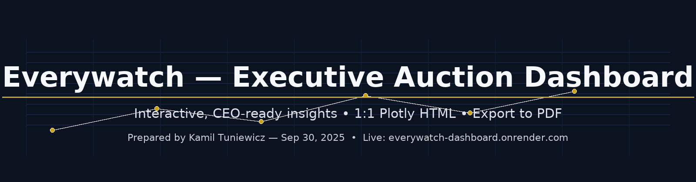

# Everywatch — Executive Auction Dashboard

<p align="center">
  
</p>

## Live app
https://everywatch-dashboard.onrender.com/  
> First load may take a few seconds on the free tier (cold start).

A sample project of an interactive dashboard for auction market intelligence using the supplied dataset.  
Built with **Plotly + vanilla JS**, served as a **1:1 static HTML** (no rebuild/transformations) via a minimal Flask wrapper.

---

## 🎯 What this delivers
- **CEO‑ready views:** Overview KPIs, **Positioning** (sell‑through vs avg sold price), **Money Map** (House×Brand heatmap), **Geography** (world choropleth + top cities), **Brand Pareto**, **Revenue Flows** (Sankey, thresholded), **Sales Funnel**, and **House Focus**.
- **Smart filters:** Global **Auction House** filter; **Sale End Period** by month (Last 3/6/12m, YTD, All); dependent **Region→Country** and **Brand→Model**; materials, colors, case size, price ranges, lot status. **Reset (All data)** included.
- **Auto‑insights:** One‑line takeaways under each chart.
- **Export:** Print‑friendly **Export PDF** (top bar) respects current filters.
- **Branding:** Everywatch colorway + executive typography.

---

## 🧱 Tech stack
- **Front‑end:** Plotly.js, vanilla JS, responsive CSS.
- **Serving:** Flask + Gunicorn (only to host the static HTML on Render.com).  
  *All interactivity is client‑side; no backend is required to run the dashboard.*

---

## ▶️ Local run (optional)
```bash
python -m venv .venv
# Windows: .venv\Scripts\activate
# macOS/Linux:
source .venv/bin/activate
pip install -r requirements.txt
python app.py   # open http://localhost:8000
```

---

## ☁️ Deploy to Render.com (recommended)
- Create a new **Web Service** from this repo.
- Render will auto‑detect `render.yaml`. If not, set:
  - Build: `pip install -r requirements.txt`
  - Start: `gunicorn app:app`
- Health check path: `/health`

---

## 🔬 Notebook (backend reasoning)
Open `notebooks/Everywatch_BI_Challenge.ipynb` to see:
- Data cleaning & feature engineering mirroring the dashboard inputs.
- Validation KPIs that match the Overview (Lots, Sold, Sell‑through, Revenue, Avg Sold).

---

## 👤 Credit
**Prepared by:** Kamil Tuniewicz  •  **Date:** Sep 30, 2025
